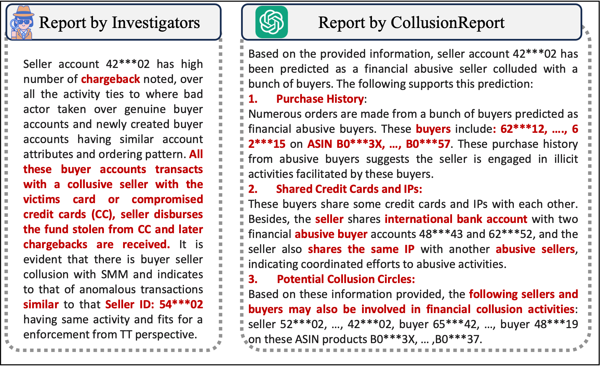

# Explanation of TaskReport
This repository contains an illustrative figure, the detailed prompting of TaskReport, and the detailed prompting of LLM-as-a-Judge to evaluate the quality of reports.

## Showcase of Reports

This is an illustrative figure to illustrate the differences between reports written by human investigators and TaskReport.
<p align="center">
    
</p>


## Detailed Prompting 

This is the detailed prompting of generating reports via Claude Sonnet for group financial collusion.
* Input: the target user id, relation_triplets, predicted_labels from fine-tuned models.
* Output: the report generated by LLM models

```
#  system prompt
system_prompt = """
You are an expert in group collusion detection for e-commerce platforms. Your task is to analyze a set of data related to sellers, buyers, and products, and provide an interpretable report explaining whether there is evidence of group collusion between a target user and others to commit financial collusive activities.
"""

#  prompt
prompt = """
You will be given the following information:
1. A target user
2. A set of triplets representing relationships between sellers, buyers, and products. Each triplet consists of:
   - Source node (e.g., 'seller_1')
   - Relation type (e.g., 'purchase', 'sell', 'credit card')
   - Destination node (may be encrypted as 'graphen_WDZWHAC2SH3' for privacy)
For instance, given a triplet ('seller_1','credit card','graphen_WDZWHAC2SH3'), it shows seller_1 owns the credit card that encrypted as 'graphen_WDZWHAC2SH3'. If the credit card is the same, then the encrypted values should be the same.
3. Predicted labels for the target user, as well as for all other users and products involved in the triplets. These labels are provided by an upstream detection model.

Here is the desciption about all relation types in <relation></relation>. 
<relation>
- purchase: A buyer purchased a product on the e-commerce platform.
- sell: A seller sold a product on the e-commerce platform.
- credit card: A user used this credit card for transactions on the e-commerce platform.
- bank account: A user has this bank account listed on their account.
- international bank account: A user has this international bank account listed on their account.
- ubid: A user was associated with this unique browser identifier when accessing the website.
- flash ubid: A user was associated with this flash unique browser identifier when accessing the website.
- IP: A user accessed the Amazon website or app from this IP address.
- fingerprint: A user was associated with this browser fingerprint when accessing the website or app.
- email: A user has this email address listed on their account.
- sign-in: A user used this sign-in method when accessing the website or app.
</relation>

Your task is to analyze this information and generate a report:
1. Summarize whether you believe the target user is involved in group collusive financial activities based on the provided data.
2. Explain your reasoning in detail, drawing insights from the relationships represented by the triplets and the predicted labels.
3. Identify any potential collusive groups, if applicable, based on your analysis.


The input data will be provided in the following format:
<target>
{target_user}
</target>

<triplet>
{relation_triplets}
</triplet>

<label>
{predicted_labels}
</label>

You should EXACTLY follow the format to generate the report:
<report>
<summary> Provide a summary of your findings </summary>
<explain> Provide a detailed explanation of your analysis </explain>
<potential collusion> List any potential collusive groups you have identified </potential collusion>
</report>

Please generate the interpretable report using the instructions and format above.

Assistant:
"""
```

This is the detailed prompting of LLM-as-a-Judge to evaluate the factuality and clarity of the generated report. 

* Input: the generated report via LLM relation_triplets.
* Output: correctness scores, factual errors, clarity scores, unclear statements, justification.

```
#  system prompt
system_promot = """
You are an impartial evaluator tasked with assessing the quality of a response based on three criteria: correctness and clarity.
"""

#  evaluation prompt
prompt = """
    
You will be given the following information:
1. A report generated by LLM 
2. A set of triplets representing relationships between sellers, buyers, and products. Each triplet consists of:
   - Source node (e.g., 'seller_1')
   - Relation type (e.g., 'purchase', 'sell', 'credit card')
   - Destination node (may be encrypted as 'graphen_WDZWHAC2SH3' for privacy)
For instance, given a triplet ('seller_1','credit card','graphen_WDZWHAC2SH3'), it shows seller_1 owns the credit card that encrypted as 'graphen_WDZWHAC2SH3'. If the credit card is the same, then the encrypted values should be the same.
3. Predicted labels for all users and products involved in the triplets.

Please use the following rubrics to rate the response:
<Correctness>
Is the report factually correct compared with the relation triplets and the predicted labels? You should use the provided information to judge the correctness. 
Rate from 1-3:
3 - Correct, All information in the report is factually accurate and directly related to the relation triplets and predicted labels, with no uncorrect information.
2 - Partial Correct, Most of the information in the report is correct, but there may be some minor factual errors or inaccuracies. The report may include a small amount of irrelevant information or incorrect information compared with relation triplets and predicted labels.
1 - Incorrect, The report contains significant factual errors, is based on incorrect assumptions or misunderstandings, or does not match the relation triplets and predicted labels at all, focusing instead on unrelated aspects.

List any factual errors in the report compared with relation triplets and predicted labels.
</Correctness>


<Clarity>
Is the report clear, easy to understand, well-structured and formatted? 
Rate from 1-3:
3 - Clear, understandable, well-structured and formatted, easily accessible.
2 - Generally understandable but may have ambiguities. Text is readable but could be improved with better formatting.
1 - Confusing or difficult to understand.

List any unclear or confusing statements.
</Clarity>

Here is the report you need to rate:
<report>
{report}
</report>

Here is all triplets that tou can consider:
<triplet>
{relation_triplets}
</triplet>


Please STRICTLY follow the below format in your response:
<Rating>
Correctness: <A number from 1-3>
Factual Errors: <A bulleted list of any factual errors in the response compared to the reference answer.>
Clarity: <A number from 1-3>
Unclear Statements: <A bulleted list of any unclear or confusing statements in the response.>
Justification: <Provide your reasoning for the ratings>
</Rating>

Please rate the correctness and clarity of the given report using the instructions and format above.

Assistant:
"""
```
